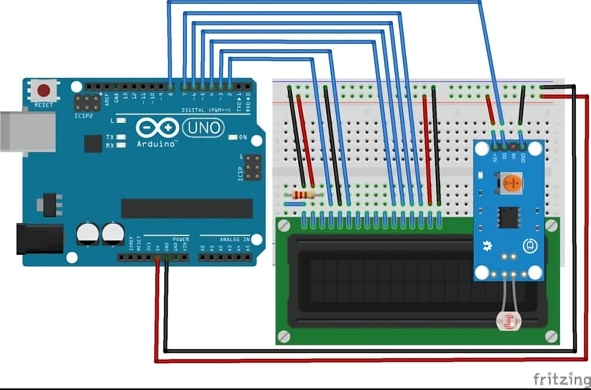

# LiFi Communication Device

## Introduction
LiFi (Light Fidelity) is a wireless communication technology that uses light to transmit data. Unlike WiFi, which uses radio waves, LiFi employs visible, ultraviolet, or infrared light for high-speed data transmission. This project demonstrates a basic LiFi communication system using Arduino hardware and a custom Android application (APK).

## How LiFi Works
- Data is transmitted by modulating the intensity of light (typically from LEDs).
- A light sensor (LDR) detects the modulated signal and converts it back to data.
- LiFi offers advantages such as high speed, reduced interference, and enhanced security (since light does not penetrate walls).

## Hardware Components
- **Arduino Uno**: Microcontroller board for signal processing and control.
- **LDR Sensor Module**: Detects light intensity changes for data reception.
- **16x2 LCD Display**: Displays received messages.
- **Wiring**: Connect components as per the pin configuration in the Arduino code.
- **Resistor**: 1k-ohm

### Wiring Example

*Figure: Schematic diagram of the LiFi receiver hardware setup. Shows the wiring between Arduino Uno, LDR sensor module, and 16x2 LCD display.*

- LDR digital output → Arduino digital pin 8
- LCD RS, E, D4-D7 → Arduino pins 2, 3, 4, 5, 6, 7 (as in code)
- LCD RW → GND, VSS → GND, VDD → +5V, VO → Potentiometer for contrast

## Software Components
- **Arduino Code**: Provided in `lifi_receiver.ino`. Reads LDR input, decodes the signal, and displays messages on the LCD.
- **Android APK**: `LiFiProject (2).apk` is a mobile app to send messages via LiFi transmitter hardware (not included here).

## Setup Instructions
### Hardware
1. Assemble the circuit as per the wiring diagram and pin configuration above.
2. Upload `lifi_receiver.ino` to the Arduino Uno using the Arduino IDE.
3. Power the Arduino and ensure the LCD and LDR are connected properly.

### Software
1. Install the APK (`LiFiProject (2).apk`) on your Android device:
    - Transfer the APK to your device.
    - Enable installation from unknown sources in your device settings.
    - Tap the APK to install.
2. Open the app and use it to send messages via your LiFi transmitter hardware.
3. The Arduino receiver will decode the message and display it on the LCD.

## Working Model

*Figure: Physical working model of the LiFi receiver project, demonstrating the assembled hardware including Arduino, LDR, and LCD display.*

This image shows the actual hardware prototype as assembled for the LiFi communication demonstration. The LDR sensor receives data via light, which is then processed by the Arduino and displayed on the LCD.

## Advantages
- High-speed data transmission
- Reduced interference
- Enhanced security
- Energy efficiency
- High capacity and performance in dense environments

## Limitations
- Requires line of sight between transmitter and receiver
- Limited range (light cannot penetrate walls)
- Affected by ambient light and environmental conditions
- Device compatibility (requires specific hardware)

## Project Files
- `lifi_receiver.ino`: Arduino code for the LiFi receiver
- `LiFiProject (2).apk`: Android application for sending messages via LiFi
- `LIFI.pptx`: Project presentation

## Credits
- Project based on research and concepts from Prof. Harald Haas and others in the LiFi field.
- Hardware and software design by [Your Name/Team].

---

**Note:** To use the APK, users must have compatible LiFi transmitter hardware. This repository provides the receiver implementation and example code for educational purposes.
